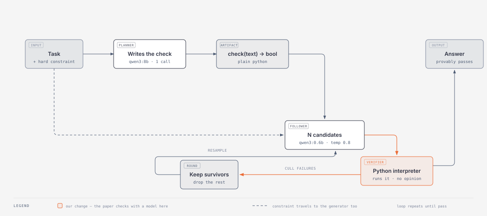
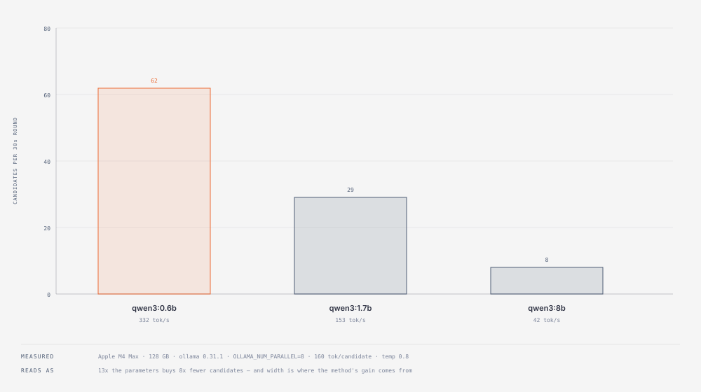

# plan-then-cull

**A big model writes the test. A tiny model takes it, sixty times. A Python interpreter grades it.**

Built for [Sundai Hack 138 — *Beyond Scale: Small Models, Big Applications*](https://www.sundai.club/) (MIT, 30 Aug 2026). The organizers set one challenge: **make a small model smarter, not bigger.** This is a plan and a set of measurements for doing that honestly.

MIT licensed. Everything here runs on one laptop with no API key.

---

## The problem, explained from zero

Imagine you ask someone to write a sentence where **every word starts with the letter S**.

A very expensive, very smart person gets it right most of the time. A cheap, fast person gets it right *almost never* — they write a nice sentence and forget the rule halfway through.

The whole industry's answer to this has been: **hire the more expensive person.** Make the model bigger. That works, and it costs more every single time you ask.

But there is a second answer, and it is strange:

> Ask the cheap person **sixty times**, throw away every attempt that breaks the rule, and keep one that survives.

You don't need a smarter writer. You need **a lot of cheap attempts and a reliable way to check them.**

That is the entire idea. The rest of this repo is about the two words doing the real work: *a lot*, and *reliable*.

---

## What we're building on

The hack's challenge statement links to [an MIT News article](https://news.mit.edu/2025/enabling-small-language-models-solve-complex-reasoning-tasks-1212), which describes a paper called **DisCIPL** ([arXiv:2504.07081](https://arxiv.org/abs/2504.07081), COLM 2025).

DisCIPL splits the job across two models:

- A **Planner** (big, runs *once*) reads the task and writes a little program that can check an answer.
- A crowd of **Followers** (small, run *many times*) generate candidate answers. The program checks each one. Bad ones get thrown away. Survivors get copied and mutated. Repeat.

The headline result: a **1-billion-parameter** model went from **0.07 to 0.84** on constrained-generation tasks — beating GPT-4o, which is enormously larger.

The capability didn't come from the model. It came from **the structure around the model**.



---

## The one thing we changed

Here is the loose thread we pulled on.

In DisCIPL, **the checking program is written by a model.** It's a good program, usually. But it is a guess produced by the same kind of system whose output it is grading. When it's wrong, it's wrong *quietly* — it approves an answer that breaks the rule, and nothing errors.

The paper says so itself: bugs in generated programs can *"yield incorrect outputs without triggering any errors."*

So our change is small and stubborn:

> **The verifier is a Python interpreter, not a model.**
>
> `check(text) -> bool` actually runs. If the sentence has a word that doesn't start with S, the function returns `False`, and no amount of confident prose changes that.

An interpreter cannot be talked into agreeing with you. That's the whole pitch.

This is the same principle as [`reasoning-over-recall`](https://github.com/wilsonwu-ai/reasoning-over-recall) — *execute, don't judge* — applied to the hack's own source material.

---

## Approaches we considered, and why we didn't pick them

We generated 21 candidate projects across seven framings, cut them to 8, and ran each past three adversarial reviewers (a build-timeline skeptic, a novelty skeptic, and a "does this land from the back row" skeptic). Seven of the eight were killed. Here is the honest board:

| Approach | The idea | Why not |
|---|---|---|
| **Grammar Gate** | Make a bad token literally unsamplable via constrained decoding | Ollama's MLX engine **silently ignores** the JSON-schema `format` parameter. The demo would have looked like it worked all night and proved nothing. |
| **Exchange Rate** | Measure how many verified samples of a 0.8B model equal one 4B model | An eval/leaderboard project. Sundai has shipped **five** of these in 2026 and ran a whole self-improving-evals hack six days before this one. Most-burned idea in the room. |
| **Particle Room** | Every phone in the audience becomes one particle of a shared search | Depends on the room showing up and on conference wifi. Great when it works; nothing on screen when it doesn't. |
| **Outvoted** | Replicate a result showing majority voting makes small models *worse* | A negative result is hard to show in two minutes, and the fix it proposed was unproven. |
| **Anytime Arena** | A model in a 60fps game loop with a deadline it can't miss | Strong visual. But a no-model baseline beats it at 0ms unless the decision unit is a multi-move plan, which doubles the build. |
| **Clean Room** | Private docs extracted in-browser with the wifi off | Real use case, but the demo is "nothing happens, securely." |
| **Fail Closed** | Ship the verifier as an MCP server that makes a big agent admit it's wrong | Good idea, wrong hack — it makes the *big* model better, and the brief says small. |
| **Locked Cart** | A local agent shops a real store while a malicious merchant hijacks it | Best demo in the set by far. But agentic commerce ran at this same venue **two weeks earlier** with four projects. Kept as the designated fallback. |

**Why we picked this one:**

1. **It answers the actual question.** The organizers linked a specific paper. Nobody at this venue has built it. Reading the assignment is a differentiator.
2. **The contribution fits in one sentence.** *"The paper's verifier is written by a model; we replaced it with an interpreter, and measured what that changes."*
3. **It routes around every runtime bug we found** (see below) — as long as culling happens in rounds rather than as true parallel Sequential Monte Carlo.
4. **The honest version is buildable in a day.** No LLaMPPL, no vLLM, no probabilistic-programming library. Plain Python.

---

## What we measured

Everything below was run on the target machine the night before the hack: **Apple M4 Max, 128 GB unified memory, Ollama 0.31.1**. Scripts are in [`experiments/`](experiments/), raw JSON alongside them. Stdlib only — no install step.

### 1. Concurrency: the server queues, it does not parallelize

The method wants many candidates at once. So the first question is whether asking for many at once actually helps.

| | wall clock |
|---|---|
| 8 requests, one after another | **5.0 s** |
| 8 requests, all at once | **5.1 s** |
| speedup | **0.98x** |

Zero benefit. This reproduces [ollama#17666](https://github.com/ollama/ollama/issues/17666) on 0.31.1. It does not error — it just queues, and the natural misreading is *"small models are slow"* rather than *"my server is single-threaded."*

Setting `OLLAMA_NUM_PARALLEL=8` helps, but nowhere near 8x:

| width | 1 | 2 | 4 | 8 | 16 |
|---|---|---|---|---|---|
| speedup (`qwen3:0.6b`) | 0.94x | 1.28x | 1.83x | **2.19x** | 2.21x |

**The ceiling is ~2.2x and it flattens after width 8.** Plan the particle budget around that number, not around the core count.

### 2. `n > 1` is ignored

Asked the OpenAI-compatible endpoint for 4 samples. Got 1. Every candidate is its own round-trip, which is what makes finding #1 expensive rather than merely annoying.

### 3. Per-token logprobs *are* available — correcting our own research

We went in expecting logprobs to be unavailable on this path. **They're there**, with full `top_logprobs`:

```json
{"token": "Okay", "logprob": -0.000158,
 "top_logprobs": [{"token": "Okay", "logprob": -0.000158},
                  {"token": "Alright", "logprob": -8.76}]}
```

This matters: it means true SMC particle *weighting* is not blocked, only cheap parallelism is. We were wrong, we checked, and the plan got better. Recording it here because a corrected assumption is worth more than a confident one.

### 4. Why a small model, given a 128 GB machine

The obvious objection: this laptop can hold a 70B. Why not use it?

Because on fixed hardware, **candidates and parameters come out of the same budget** — and this method's gain comes from candidates.



| model | concurrent tok/s | parallelism ceiling | **candidates per 30s round** |
|---|---|---|---|
| `qwen3:0.6b` | **332.4** | 2.21x | **62** |
| `qwen3:1.7b` | 153.2 | 1.76x | 29 |
| `qwen3:8b` | 42.2 | 1.71x | **8** |

**13x the parameters costs about 8x the width.** The bigger model is also penalized twice — its parallelism ceiling is *worse*, because decode is memory-bandwidth-bound and 128 GB of capacity does nothing about bandwidth.

So "small" here is not a constraint being tolerated. It is the correct engineering answer to *how do I afford sixty attempts.*

The honest use of 128 GB is different: it holds an **8B Planner and a 0.6B Follower resident at the same time**, so the whole two-tier system runs offline on one laptop with no API key and no network.

---

## What this is not

Stated up front, because conceding limits before anyone asks is the point.

- **We did not invent this.** The mechanism is DisCIPL's. Our change is the verifier.
- **A round-based cull is not Sequential Monte Carlo.** Real SMC weights particles by conditional probability. We approximate with sequence-level pass/fail. Logprobs make the real thing *possible*, not *implemented*.
- **An interpreter is a correctness filter, not a security boundary.** A subprocess with a timeout stops mistakes, not attackers.
- **These numbers are Apple-platform-specific.** They were measured on one M4 Max. A 16 GB Mac does not even get the same Ollama backend. Compare checkpoints on one machine and say which.
- **DisCIPL does not beat o1 anywhere in the paper**, and loses to GPT-4o on paragraphs. Constraint satisfaction also costs measurable fluency. Do not read "1B beats GPT-4o" as a general claim — it is specific to constrained generation.

---

## Run it yourself

```bash
ollama serve
ollama pull qwen3:0.6b     # 522 MB
ollama pull qwen3:1.7b     # 1.4 GB

python3 experiments/runtime_probe.py --model qwen3:1.7b --n 8
OLLAMA_NUM_PARALLEL=8 ollama serve   # then, in another shell:
python3 experiments/parallel_sweep.py --model qwen3:0.6b --widths 1,2,4,8,16
```

`runtime_probe.py` answers *"can this machine run a particle method at all?"* in about a minute.
`parallel_sweep.py` answers *"how wide can I go before it stops helping?"*

Run them before building anything that assumes parallel sampling works. That is the actual lesson: **verify a runtime by its measured side effect, never by the fact that a call returned.**

---

## Related work of ours

- [`reasoning-over-recall`](https://github.com/wilsonwu-ai/reasoning-over-recall) — why you'd train a small model to reason instead of memorize, plus an execution-based verifier for training data
- [`smoleval`](https://github.com/wilsonwu-ai/smoleval) — eval harness for small code models, sandboxed execution, unbiased pass@k
- [`vibe-silicon`](https://github.com/wilsonwu-ai/vibe-silicon) — Sundai Hack 135: a language model running on an $82 FPGA

## License

MIT — see [LICENSE](LICENSE). Contributions welcome.
